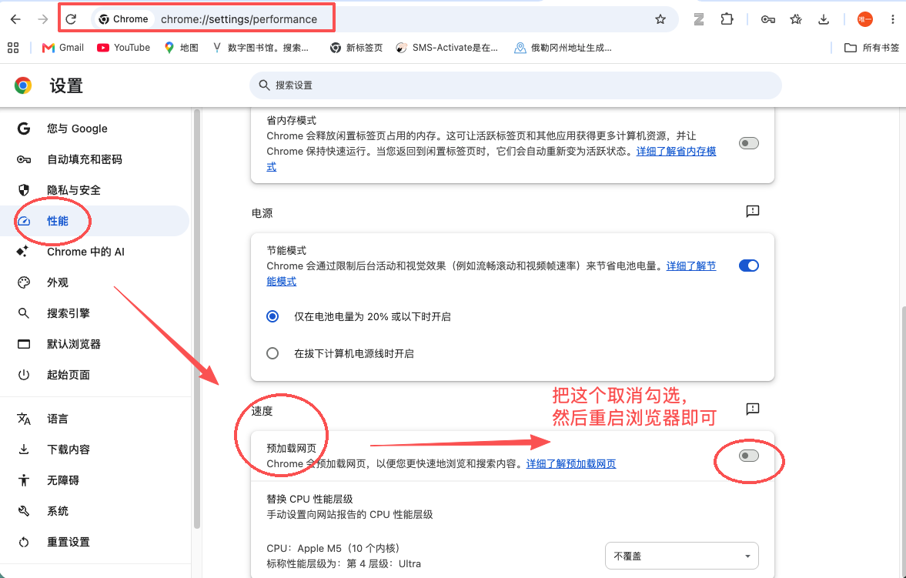

最近发现在网络正常的情况下，Chrome 浏览器新标签页的搜索引擎一直很不稳定：

1. 经常遇到在中部搜索栏直接搜索会一直卡住，加载不出来。
2. 顶部搜索栏也会有类似的问题。
3. 该问题与检索关键词的长短和内容无关，而且有时前一秒能秒开，后一秒又加载不出来。
4. 直接在地址栏显式调用 `https://www.google.com/search?q=xxxxxxx` 则能稳定秒开，没有上述问题。

*配图 1：顶部和中部搜索框持续加载*

*配图 2：地址栏直接显式调用可以稳定秒开*

## 原因分析

问题可能与 Chrome 为加速搜索而使用的 **Preload Pages（预加载网页）** 推测性加载机制有关。Chrome 官方提供了关于[默认搜索引擎 Omnibox 预取机制的设计说明](https://www.chromium.org/developers/design-documents/omnibox-prefetch-for-default-search-engines/)。

推测该机制在 **Chrome + 代理/TUN 网络环境**下会出现间歇性异常，使搜索框发起的导航尝试使用一个异常的预加载状态，从而无限转圈。目前尚不确定这个 Bug 究竟由哪一段链路引起。

## 解决方式

打开 Chrome 浏览器，依次进入：

**设置（Settings）→ 性能（Performance）→ 速度 → 预加载网页（Preload pages）**

找到并关闭“预加载网页”，然后重启 Chrome，即可解决该问题。

*配图 3：关闭“预加载网页”开关的位置*

## 说明

Chrome 官方描述 Preload 的目的本来就是让浏览和搜索更快。关闭以后不会影响 Google 搜索功能和网页正确性。
